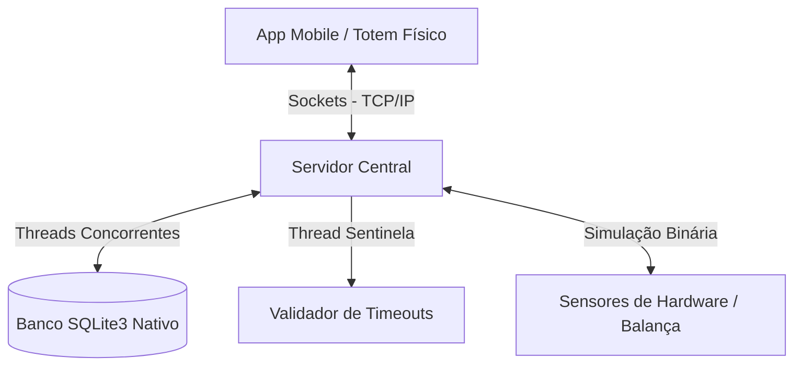

# 🛒 Max Smart Market

> **Simulador de Mercado Autônomo com Armários Inteligentes**  
> *Automated Market Simulator — A Pure Code Engineering Experiment*

---

> [!WARNING]
> **PROJETO DE APRENDIZAGEM (MODELO DESAFIO)**  
> Este projeto foi desenvolvido sob a filosofia *pure code* (zero frameworks ou ORMs externos). O objetivo é construir toda a lógica de rede, concorrência, persistência e validação de hardware de forma nativa, compreendendo os fundamentos da computação e da engenharia de software "na raça".

---

## 📋 PARTE 1: O Projeto, Funcionalidades e Valor de Negócio

### 🔹 O que é e Finalidade
O projeto consiste no simulador de um ecossistema completo para um **Mercado Autônomo baseado em Armários Inteligentes e Despacho por Comando**, projetado especificamente para ambientes controlados como condomínios residenciais ou comerciais.

A finalidade é eliminar a intervenção humana no processo de venda e, ao mesmo tempo, erradicar as principais falhas operacionais dos mercados autônomos tradicionais (baseados em prateleiras abertas e na total honestidade do cliente).

---

### ⚙️ Funcionalidades e Features Principais

*   **📱 Reserva Antecipada Remota (App/Mobile):** O cliente consulta o estoque disponível de casa. Se houver o produto, ele pode realizar uma reserva garantida por um tempo limite ($N$ minutos). O estoque para venda é atualizado instantaneamente, impedindo que outros comprem o item reservado.
*   **🚫 Sistema de Penalização por Abuso:** Monitoramento do histórico de reservas. Caso um usuário deixe suas reservas expirarem por $X$ vezes consecutivas, o sistema bloqueia novos agendamentos por um período determinado.
*   **🖥️ Terminais Físicos de Compra:** Totens dentro do estabelecimento onde o cliente monta seu carrinho, realiza o pagamento e gera um token/código único de retirada.
*   **🔒 Módulo de Armários e Freezers Inteligentes:** Os produtos ficam trancados fisicamente. A liberação ocorre apenas após a inserção do token válido.
*   **⚖️ Auditoria por Sensores de Peso:** Após a abertura e fechamento de um armário, o sistema lê o sensor de pressão virtual (balança) e valida se a variação do peso bate exatamente com o peso unitário dos produtos comprados.
*   **🚨 Tratamento de Exceções em Tempo Real (Detecção de Furto):** Se a variação de peso for divergente do esperado, o sistema bloqueia o usuário, emite um alerta sonoro e notifica a administração do condomínio.

---

### 🛡️ Problemas que o Sistema Resolve

| Desafio Tradicional | Solução do Max Smart Market |
| :--- | :--- |
| **Quebra de Estoque (Furto Oportunista)** | Produtos trancados até a confirmação do pagamento. Elimina o furto de pegar o item e não passar no caixa. |
| **Furto de Reserva** | Impede que um cliente físico na loja leve um produto que já havia sido reservado remotamente via app. |
| **Desapontamento do Estoque** | O morador sabe a disponibilidade exata de casa e garante o item antes de se deslocar até o mercado. |
| **Concorrência de Compra** | Resolve conflitos de dois clientes tentarem comprar o mesmo "último item" do estoque ao mesmo tempo. |

---

### 💰 Valor de Negócio
Para o operador do mercado (provedor), este sistema representa **previsibilidade financeira e proteção de margem**. 

A automação baseada em hardware restritivo reduz o índice de perdas a quase 0%, barateia o custo de segurança e câmeras de vigilância avançadas e maximiza a satisfação do cliente final, que passa a ter uma experiência de compra integrada, confiável e sem atritos de estoque.

---

## 🛠️ PARTE 2: Conceitos de Aprendizagem, Ferramentas e Estrutura

Este projeto serve como um laboratório prático para consolidar conceitos de sistemas distribuídos, concorrência e persistência segura de dados de forma nativa.

### 🧰 Módulos Nativos Utilizados (Python)

*   `sqlite3`: Introdução ao desenvolvimento com Bancos de Dados Relacionais (SQL), substituindo JSONs por tabelas estruturadas, transações e índices gerenciados pelo motor do banco.
*   `socket`: Comunicação de rede estruturada no modelo Cliente-Servidor, gerenciando o tráfego de dados entre o servidor central e os múltiplos terminais (App mobile e Totem físico).
*   `threading`: Execução paralela para gerenciar múltiplas conexões de clientes simultâneos e para rodar serviços de segundo plano.
*   `time` / `datetime`: Controle estrito de janelas temporais, timeouts de reserva e auditoria de logs.

---

### 🏗️ Conceitos Estruturais e Arquitetura do Código

*   **Arquitetura de Dados Relacional (SQL):** Rompimento com a busca linear de arquivos e adoção de consultas lógicas ($O(\log n)$ via Árvores B+ controladas pelo banco). Modelagem focada em consistência e integridade referencial.
*   **Estados Dinâmicos de Estoque:** Separação lógica do inventário em três camadas distintas dentro da tabela de dados: `Estoque Físico`, `Estoque Reservado` e `Estoque para Venda`.
*   **Transações Seguras (ACID):** Uso de travas nativas do banco de dados (`commit` e `rollback`) para garantir que operações financeiras e de estoque aconteçam sob o princípio do "tudo ou nada", evitando dados corrompidos.
*   **Gerenciamento de Concorrência Física:** Implementação de regras de negócio no backend para traduzir eventos de hardware virtuais (sensores de peso e trincos magnéticos) em manipulação de dados em memória e disco.
*   **Thread Sentinela (Garbage Collector de Reservas):** Linha de execução dedicada no servidor que atua como zeladora, varrendo o banco de dados periodicamente para liberar produtos cujas reservas estouraram o tempo limite.
*   **Manipulação Binária de Arquivos:** Abstração de imagens e códigos de barra lidos como matrizes de bytes brutas, forçando o algoritmo a decodificar padrões binários ($0$ e $1$) na raça para identificação de produtos.

---
